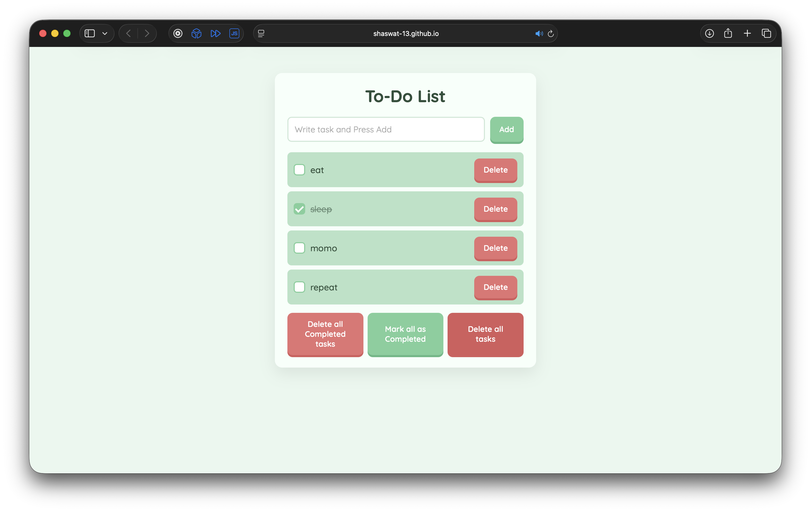

# To-Do List Web App

## Overview

A lightweight **To-Do List web application** built using **HTML, CSS, and Vanilla JavaScript**.
The app allows users to create, manage, and persist tasks directly in the browser using **Local Storage**.

This project was built to practice **core frontend development concepts**, including DOM manipulation, event handling, and client-side data persistence.

---

## Live Demo

https://shaswat-13.github.io/todolist/

---

## Features

* Add new tasks
* Mark tasks as completed
* Delete individual tasks
* Delete all tasks
* Delete completed tasks
* Mark all tasks as completed
* Persistent storage using **LocalStorage**
* Responsive and clean UI

---

## Technologies Used

* **HTML5** – structure and layout
* **CSS3** – styling and UI design
* **JavaScript (ES6)** – application logic and DOM manipulation
* **Local Storage API** – client-side persistence

---

## Screenshot





---

## Project Structure

```
todolist/
│
├── index.html
├── style.css
├── script.js
├── todolist.png
└── README.md
```

---

## Key Concepts Practiced

* DOM manipulation
* Event listeners and event handling
* Dynamic element creation
* JSON data storage
* LocalStorage persistence
* Basic frontend UI design

---

## Learning Outcome

Through this project I practiced building a **complete interactive frontend application** from scratch using plain JavaScript without frameworks. It helped strengthen understanding of **state management, user interaction, and browser storage mechanisms**.

---
